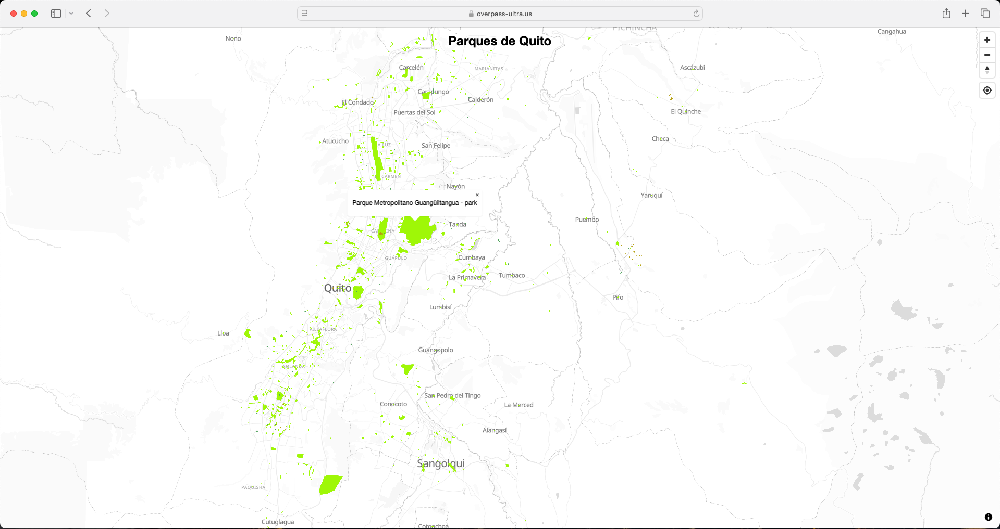

---

##### Acceso al tutorial

+ [Download PDF](ultra_tutorial.pdf)
+ [Online tutorial](https://fmvaldezg.codeberg.page/ultra_tutorial_sp/ultra_tutorial.html)

---

##### Resumen

Ultra es una aplicación web que te ayuda a crear mapas interactivos personalizados utilizando datos de OpenStreetMap. Este tutorial te muestra paso a paso cómo construir consultas (queries) de mapas, estilizar elementos del mapa con diferentes colores, añadir características interactivas como ventanas emergentes y controles de navegación, y compartir tus mapas terminados en línea. Utilizando un ejemplo práctico de mapeo de parques en Quito, enseña a los principiantes cómo transformar datos geográficos en mapas visualmente atractivos y útiles sin necesidad de habilidades técnicas avanzadas.

---

##### Mapa de ejemplo

---

##### Atribución

  <a property="dct:title" rel="cc:attributionURL" href="https://felipevaldez.com/ultra_tutorial/ultra_tutorial.html">Open Geospatial Data</a> by 
  <a rel="cc:attributionURL dct:creator" property="cc:attributionName" href="https://felipevaldez.com/">Felipe Valdez</a> is licensed under 
  <a href="https://creativecommons.org/licenses/by-nc-sa/4.0/?ref=chooser-v1" target="_blank" rel="license noopener noreferrer" style="display:inline-flex; align-items:center;">
    CC BY-NC-SA 4.0
    
    
    
    
  </a>

---

##### Material relacionado

+ [Ultra documentation](https://overpass-ultra.us/docs/)
+ [Overpass API documentation](https://wiki.openstreetmap.org/wiki/Overpass_API)
