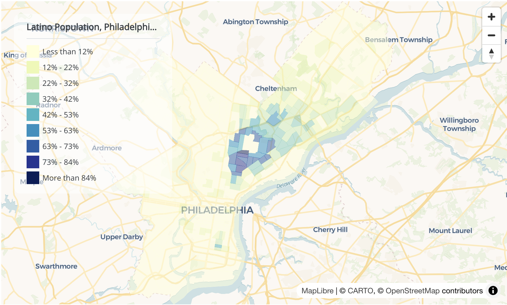

---

##### Access the tutorial

+ [Online tutorial](https://felipevaldez.com/mapping_census_R_workshop2024/mapping_census_r_web.html)
+ [Download PDF](mapping_census_r.pdf)

---

##### Abstrsact

This tutorial, "Mapping Census Data in R," teaches participants how to access, analyze, and visualize US Census data using R programming. The tutorial focuses on using the tidycensus package to retrieve American Community Survey (ACS) data, particularly examining Latino population distribution across Pennsylvania. Participants learn to query specific census variables, calculate demographic percentages, and create both static and interactive visualizations using various R packages including ggplot2 and mapgl. The tutorial progresses from basic county-level maps to more detailed census tract analysis, and concludes with creating interactive maps featuring popups, tooltips, and navigation controls. Throughout, participants follow practical exercises that demonstrate how to analyze spatial patterns in demographic data and customize maps for effective data communication.

---

##### Sample map

---

##### Attribution

  <a property="dct:title" rel="cc:attributionURL" href="https://felipevaldez.com/mapping_census_R_workshop2024/mapping_census_r_web.html">Mapping Census Data in R</a> by
  <a rel="cc:attributionURL dct:creator" property="cc:attributionName" href="https://felipevaldez.com/">Felipe Valdez</a> is licensed under 
  <a href="https://creativecommons.org/licenses/by-nc-sa/4.0/?ref=chooser-v1" target="_blank" rel="license noopener noreferrer" style="display:inline-flex; align-items:center;">
    CC BY-NC-SA 4.0
    
    
    
    
  </a>

---

##### Related material

+ [tidycensus](https://walker-data.com/tidycensus/)
+ [mapgl](https://walker-data.com/mapgl/)

